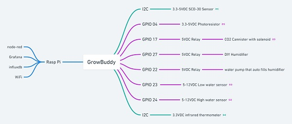
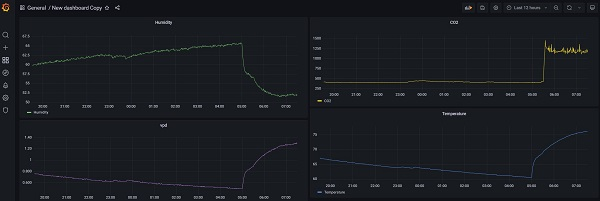
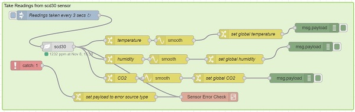
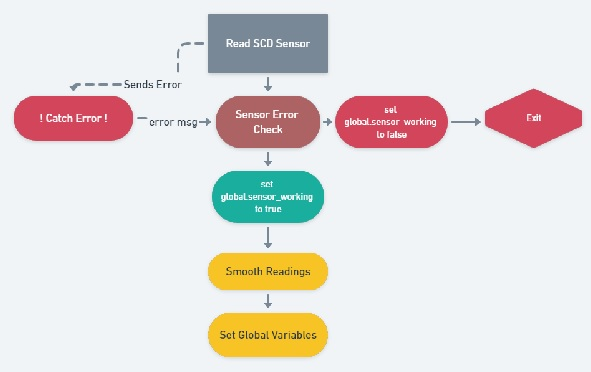
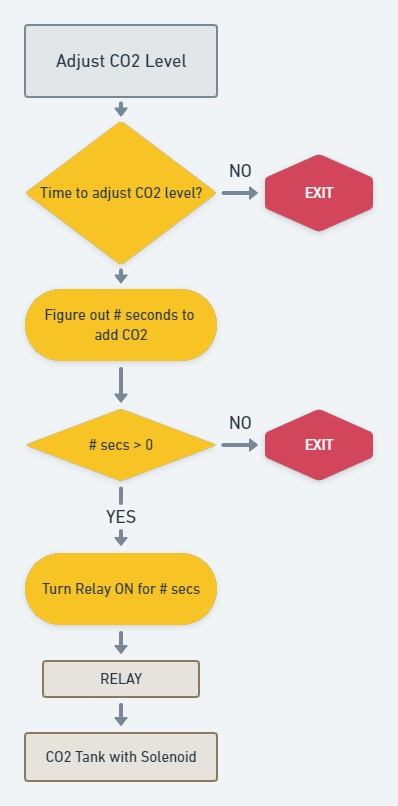
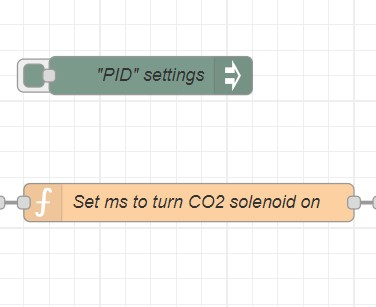
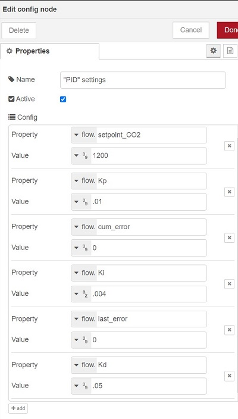

# What is GrowBuddy?
GrowBuddy:
<iframe style="border:none" width="800" height="450" src="https://whimsical.com/embed/FeXJ723nJx8YGJT4TGzWy7"></iframe>

_The [drawing in Whimisical](https://whimsical.com/growbuddy-FeXJ723nJx8YGJT4TGzWy7) includes links of interest._

Includes...
## Air Sensor
An Air Sensor built around an scd-30 sensor attached to an ESP32 microcontroller running Tasmota to monitor the CO2, air temperature, and humidity level within an indoor grow tent.  

The Air Sensor runs on battery and sends the CO2 level, air temperature, and humidity level to the mosquitto (mqtt) broker running on the Raspberry Pi.
### Hardware
- [SCD30 sensor from Adafruit](https://www.adafruit.com/product/4867)
- [ESP32 mini32](https://forum.mhetlive.com/topic/8/mh-et-live-minikit-for-esp32) I had in my parts bin.
- A [LiPo battery](https://www.adafruit.com/product/258) I had ordered from Adafruit a while back.
- Because the battery ranges from 4.2 - 3.7V and these inexpensive ESP32's will blow at powering about 3.6V, I run the battery's power through an LDO I bought awhile ago on eBay or Alibaba (I don't know the brand it has a pwm on it to adjust the output voltage to 3.6).
### Firmware
Tasmota Sensors build with mqtt set up to an mosquitto broker running on a local Raspberry Pi.
### Enclosure
The enclosure was designed within F360 and printed on a Prusa MK3s.  Files within the enclosure folder include:
- GrowBuddyParams.csv: settings imported into F360.
## CO2 Actuator
A CO2 Actuator built on an ESP32 running Tasmota that subscribes to an mqtt message that tells it how long to turn the CO2 cannister's solenoid valve on.  
## Humidifier Water Level Adjuster
A Water Level sensor that detects high and low water conditions and will pump water into the humidifier's water reservoir when a low water condition is detected.
## LED light on/off Detection

## node-red Management
node-red is used to manage everything.  More on that below.

 _NOTE: I found node-red to be a simple and powerful way to code up all incoming/outgoing activities as well as provide "smarts" such as given a grow state (e.g. Vegetative versus Flowering), how much CO2 to add and what humidity level should the grow tent space be at._


Automatic adjustment of CO2 using a solenoid valve attached to a CO2 cannister
monitors and adjusts the CO2 and humidity level within an indoor grow tent.  The humidity level is adjusted through monitoring and adjusting the VPD level.
- saves readings into a database and plots the values for a comprehensive view of the environmental factors.

My goal for Grow Buddy is to be the little buddy that does the tedious tasks so that I can enjoy other aspects of growing indoor plants.  With that said, when I am home I will always check up on my plants daily.    The jobs GrowBuddy handles for me include:
## GrowBuddy Jobs
- __Adjusting the CO2 level__ to the ideal level based on lights on/off.
- __Adjusting the humidity level__ to the ideal VPD level.
- __Refilling the humidifier__ when the water is low.

## Jobs GrowBuddy Does Not Do
- __Adjust the temperature__ I don't adjust the temperature because where I live the temperature stays within a reasonable level for the plants to thrive.

- __Monitor and Adjust the Air Flow__ I provide air flow by linking several PC fans together.  The fans run 7/24.

- __Adjust the PPFD Level__ Light is provided by an LED setup.  Lighting is turned off/on for the correct photoperiod using a Kasa smart plug.  The PPFD value is hand adjusted using a PAR meter.  Perhaps in the future I could automate the distance the lights are from the plants based on PAR readings.

I am working on extending GrowBuddy to include __(Doctor GrowBuddy)__.  Doctor GrowBuddy uses robotics, a camera, and machine learning to aid in plant health diagnosis.

This document focuses on the #1 job: automating the obvious (CO2 enrichment level and humidity based on growth stage).
# GrowBuddy Overview
GrowBuddy:
- Adjusts the CO2 level.
- Adjusts the humidity level.
- Refills the container holding water for the humidifier.

GrowBuddy does not: 
- Automate air circulation and ventilation.  I haven't seen a need to.  Rather, I add fans to circulate the air around the plant leaves.  For ventilation, I provide input and exhaust fans.
- Adjust the temperature.  The grow tent temperature typically ranges between 75 and 80 degrees without adjustment.
- Automate the PPFD value for the canopy.  I do this by adjusting the lights higher or lower.
- Automate irrigation.  Rather I choose to use the Blumat system of watering.

# Setpoints

The setpoints used for adjusting CO2 and VPD/humidity come from the [Fluence Cannabis Cultivation Guide](docs/FLU-CultivationGuide_Cannabis_WEB_PROOF_01-2020.pdf) from 2020.  These are stored in influxdb.  The table name is `CO2_setpoints`
- __PPFD__ from Figure 2, page 8.  _Note: The PPFD is not automated.  However, I use these numbers to adjust the grow lights._
- __CO2 enrichment level__ evolves from Figures 7 and 8, page. 14.  The settings I use:
    - No enrichment during germination (~ first two weeks).
    - 800 ppm while in vegetative (~ two months starting after germination).
    - 1200 ppm while in flowering (~ two months starting after vegetative)
- __VPD level__ The VPD level is calculated and used to adjust the humidity.  While VPD involves both (air and leaf temperature) and humidity, I do not adjust the temperature.  Just the humidity.  How the VPD is calculated is discussed under [Calculate the VPD](#calculate-the-vpd)


## Software (Raspberry Pi)
A __Raspberry Pi__ running __node-red__, __influxdb__, and __Grafana__ controls, stores, and monitors/graphs CO2, humidity, and air temperature.



[Source](https://whimsical.com/growbuddy-LAHevcjLgqGTK7hZa98vjn)

The node-red code is located [at this GitHub location](https://github.com/solarslurpi/node-red-leafspa).

Here is an example of what __Grafana__ displays based on values stored in __influxdb__:



And here is an example of one of the __node-red__ flows:


## Peripherals
The Raspberry Pi interacts with:
- A __[SCD-30 sensor](https://www.adafruit.com/product/4867)__ that reads the CO2 concentration, air temperature, and relative humidity.  
    - The SCD-30 uses 3 VDC and speaks to the Raspberry Pi over an I2C interface.
- A __[photoresistor](https://smile.amazon.com/gp/product/B07S683LRT/ref=ppx_yo_dt_b_search_asin_title?ie=UTF8&psc=1)__ that gives me confidence the system knows when the LED lights are on or off.  The Rasp Pi doesn't have an ADC, thus this instead of a simple photoresistor.  
- __[Two water sensors](https://smile.amazon.com/gp/product/B07FC5RGC7/ref=ppx_yo_dt_b_search_asin_title?ie=UTF8&psc=1)__ that I stick on the side of the container holding water for the humidifier at the high and low water thresholds.  These are supposed to use 5-24VDC.  However, I used GPIO pins and 3VDC.
- __Three relays__ are used to turn the CO2 solenoid on and off, turn the humidifier on and off, and one to turn the water pump on and off that delivers water to the humidifier. Each relay uses a GPIO pin.  The physical relays reside within a 3 set power outlet.  This way, the appliances being turned on and off maintain their power cords.
- _ToDo: Infrared for leaf temperature_ I use VPD to figure out how much humidity is needed.  The VPD calculation requires the leaf temperature.  Currently, I just subtract 2 degrees F from the air temperature.  That is, I approximate.  I am exploring adding [an IR thermometer](https://smile.amazon.com/gp/product/B071VF2RWM/ref=ppx_yo_dt_b_asin_title_o00_s00?ie=UTF8&psc=1)


## Code Behind The Tasks
Each automated task has it's own (node-red)flow.  The code is located in [this github repository](https://github.com/solarslurpi/node-red-leafspa).
### Read SCD Sensor


The SCD Sensor senses the CO2 level, relative humidity, and air temperature.  It is read every few seconds.    Each reading is checked for errors.
#### Reading Errors
There is a global variable, `global.sensor_working` that is used within the (node-red) flows to control whether a reading should be used in the CO2 or humidity adjustments.
- The SCD Sensor throws an error if the I2C connection is not working.  This [error is catchable](https://nodered.org/docs/user-guide/handling-errors) at runtime.
- The other errors check what the values are and determines if they are valid.

Both types of errors are handled within the (node-red) Sensor Error `Check Subflow`.  If there is an error, `global.sensor_working` is set to `false`.
##### Valid Readings
If the reading is valid, `global.sensor_working` is set to `true`. To minimize noise, a sliding window of 10 values is used to average out the noise.  The averaged readings are then put into the global variables `global.CO2`, `global.temperature`, and `global.humidity`.
##### Invalid Readings
If the readings are not valid, `global.sensor_working` is set to `false` and the number of bad readings is tracked.
### Adjust CO2 Level
The CO2 level adjustment section of code gets called every 30 seconds.

_TBD: I do not detect the amount of CO2 in a tank.  Knowing this would be useful in alerting me when I need to refill the CO2 tank.  With that said, I get a rough idea over time based on the size of the tank when refilling will occur.  Thus, this feature is a low priority._



[Source](https://whimsical.com/adjust-co2-level-3oTnu5rQ7CTUTeLPvVAv3k)

#### Time to Adjust CO2 Level?

CO2 concentration correction DOES NOT occur when:
- Maintenance is TRUE (`global.maintanence == true`)
- Readings are not valid (`global.sensors_working == false`)
- Lights are OFF (`global.CO2_ON == true`)
- Lights have been on for less than 30 minutes (`gloval.CO2_ON == true`)
#### Figure out # Secs to Turn CO2 Solenoid On
Here I use a simple PID algorithm. _Note: I have no training in PID controls._ The two node-red nodes that are used:



#### PID Settings
PID Settings is a config node.  The settings for Kp, Ki, and Kd came after a few hours of experimentation.  Besides the CO2 reading - which is in the global variable `CO2`, the variables used to control the CO2 PID include:


```
current_CO2 = global.get("CO2");
setpoint_CO2 = flow.get("setpoint_CO2");
// Calculate the error term
error = setpoint_CO2 - current_CO2;
// Calculate the Proportional Correction
Kp = flow.get("Kp");
pCorrection = flow.get("min_CO2_on")*Kp*error;
// Calculate the Integral Correction
cum_error = flow.get("cum_error")+error;
flow.set("cum_error",cum_error);
iCorrection = (cum_error*flow.get("Ki"));
iCorrection = iCorrection - iCorrection % 1;
// Calculate the Derivative Correction
last_error = flow.get("last_error");
slope = error - last_error;
dCorrection = slope*flow.get("Kd");
dCorrection = dCorrection - dCorrection % 1;
flow.set("last_error",error);
// Calculate the # Seconds to turn CO2 on
num_CO2_seconds = pCorrection + iCorrection + dCorrection;
// Clamp the Correction to not exceed a maximum 
max_CO2_seconds = 20;
min_CO2_seconds = 0;
if (num_CO2_seconds > max_CO2_seconds){
    num_CO2_seconds = max_CO2_seconds;
}else if (num_CO2_seconds < min_CO2_seconds) {
    num_CO2_seconds = min_CO2_seconds;
}
// Write stuff out to the debug window.
node.warn("current CO2 = " + current_CO2 + " Error: = "+ error);
node.warn("**>> pCorrection is "+pCorrection+" iCorrection is "+iCorrection);
node.warn("******** dCorrection is "+dCorrection);
node.warn("**** slope is " + slope);
node.warn("**** Num CO2 seconds is "+num_CO2_seconds);
msg.delay = num_CO2_seconds*1000 ;
msg.payload = msg.delay;
return msg;
```
#### Turn the CO2 valve on for # Seconds
The node-red software uses the number of seconds calculated to turn on and off the relay controlling the CO2 solenoid.
### Adjust VPD
With the LED lights on, the indoor grow temperature is between 75 and 80 degrees F.  Because of this, the temperature is not adjusted.  However, the humidity is adjusted to align with ideal VPD calculations.
<iframe style="border:none" width="800" height="450" src="https://whimsical.com/embed/W9AGKZYLEZiiAQnKKjgwmy"></iframe>

#### Calculate the VPD<a name="VPD_calc"></a>

If `global.sensor_working == true`, the VPD is calculated:
```
var air_T = global.get("temperature");
/* Assume leaf temp is 2 degrees F less */
var leaf_T = air_T - 2;
var RH = global.get("humidity");

/* see https://www.questclimate.com/vapor-pressure-deficit-indoor-growing-part-3-different-stages-vpd/ */
leaf_vpd = 3.386*(Math.exp(17.863-9621/(leaf_T+460))-((RH/100)*Math.exp(17.863-9621/(air_T+460))));
msg.payload = Number(leaf_vpd.toFixed(2));
msg.topic = "vpd"
flow.set("vpd",msg.payload)
return msg;
```
#### Time to Adjust VPD?
The [algorithm used is from a Quest website](https://www.questclimate.com/vapor-pressure-deficit-indoor-growing-part-3-different-stages-vpd/).  In the code above, the leaf temperature (`leaf_T`) is set to be 2 degrees F less than the air temperature.  This approximation is used when there is not IR thermometer pointed at a leaf.  I do not have an IR thermometer in my current prototype.  I plan on adding one once I can figure out how I want to make sure I get accurate measurements of the leaf temperature.

If


