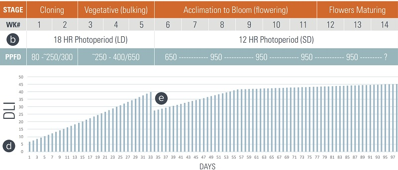

# The Director
A node-red application running on the GrowBuddy Rasp Pi Server that "dials-in" the humidity, CO2 level, and PPFD for the current growth stage of the plants.
# Dialing in PPFD
Currently, light levels are not automatically adjusted based on "the best" setpoint given the plants' stage of growth.

We use the chart in the [FLU Cultivation Guide](../docs/FLU-CultivationGuide_Cannabis_WEB_PROOF_01-2020.pdf):

- [ ] put setpoints into influxdb