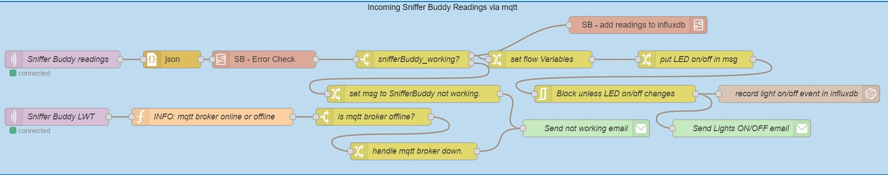

GrowBuddy Director
==================
A node-red application running on the GrowBuddy Rasp Pi Server that "dials-in" the humidity, CO2 level, and PPFD for the current growth stage of the plants.
# Sniffer Buddy Flow

## Receive Readings via mqtt
The Sniffer Buddy Flow starts out with receiving an mqtt message with the CO2, Humidity, and Temperature values read by the Sniffer Buddy (i.e.: The Sniffer Buddy readings node).  _Note: The [LWT](https://www.hivemq.com/blog/mqtt-essentials-part-9-last-will-and-testament/) topic (`tele/snifferbuddy/LWT`) to check if the readings are coming in ([more info on LWT within the Tasmota system](https://github.com/solarslurpi/GrowBuddy/blob/main/pages/mqtt_learnings.md#determining-if-device-is-sending-messages)). An email is sent out to whatever email account is set up to receive emails if it is detected mqtt messages are not received._
## Make sure Readings are Valid
The readings come in as a JSON string.  the json node converts the json string into an object:
```
{"Time":"2022-01-25T09:15:09","ANALOG":{"A0":1024},"SCD30":{"CarbonDioxide":566,"eCO2":544,"Temperature":25.6,"Humidity":38.4,"DewPoint":10.3},"TempUnit":"C"}
```
The `SB - Error Check` Subflow checks to make sure the SCD30 readings for CO2, Temperature, Humidity look good.
# Dialing in PPFD
Currently, light levels are not automatically adjusted based on "the best" setpoint given the plants' stage of growth.

We use the chart in the [FLU Cultivation Guide](../docs/FLU-CultivationGuide_Cannabis_WEB_PROOF_01-2020.pdf):


- [ ] put setpoints into influxdb

