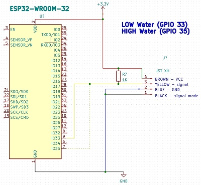
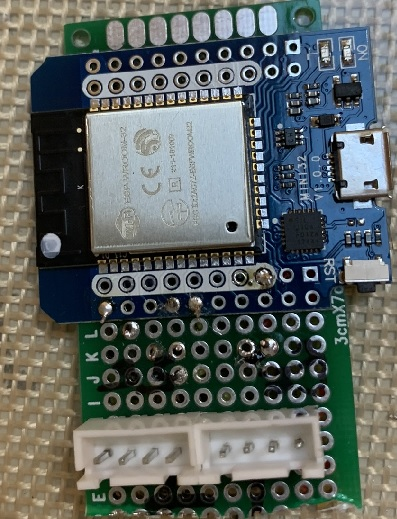
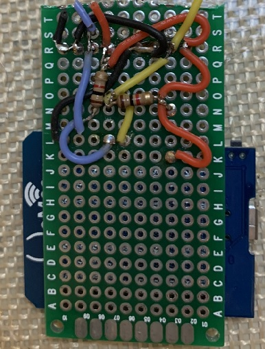
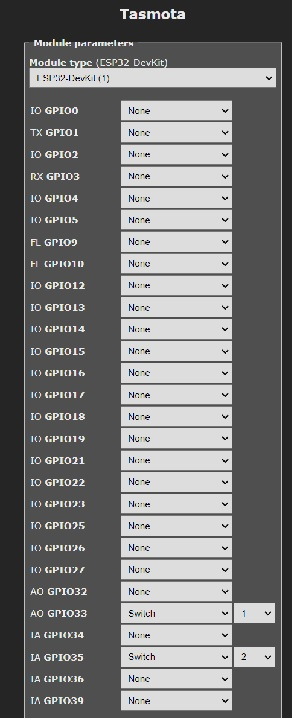

# FillerUp Buddy
[Back to Top](../README.md)

# Current Status
Prototype V2
# Hardware
- An ESP32 or ESP286 running Tasmota. 
- Two [Contactless Water Level Sensors](https://amzn.to/3FcRsNK)
- A DIY Humidifier
- An Enclosure
# DIY Humidifier
TODO
# Water Level Sensors
Two [Contactless Water Level Sensors](https://amzn.to/3FcRsNK) provide LOW and HIGH water readings.  If the LOW water sensor is triggered, a water pump is turned on and water flows into the humidifier's container.  When the HIGH water level sensor is triggered, the water pump is turned off.
## Wiring
[DFRobot's Schematic](https://github.com/solarslurpi/GrowBuddy/blob/main/docs/SEN0204%20%20Liquid%20Level%20Sensor-XKC-Y25-T12V.pdf) shows how to wire each sensor:


Also see [wiring thoughts](WIRING_and_connectors.md)

## Wire Colors
- The BLUE and BLACK wires can be combined and then go to ground.
- The BROWN wire goes to 3.3V.
- The YELLOW wire goes to a GPIO pin.  There is a 1K pull-up resistor between 3.3V and the GPIO wire.


_TBD in future: Can all this be done without node-red?_
# Fillerup Schematics


Either an ESP826 or ESP32 can be used.  I am finding the ESP826 boards I have to have challenges.  For example, when I measure the 3.3V out with a DMM on an ESP826 board, I'm reading around 2-2.5V...hmmm...The ESP32 chips I have have their own challenges.  For example, the incoming power is not regulated that well.  Thus, ideally a stable power source should be used.  With that said, higher quality boards should alleviate most of these instabilities if the board has power management on it...hmmm....

The water level sensors use `JSH XH` connectors.  The wiring is as noted above.  There is a 1K resistor between 3.3V and the signal.  Because the Black (signal mode) is connected to GND,
- __SWITCH OFF == WATER__
- __SWITCH ON == NO WATER__
Also, the sensor's red light is ON when water is detected.

We tested GPIO pins 33 and 35 with the Tasmota Sensors build.  A bit arbitrary,
- GPIO33 should be placed for LOW water detection.
- GPIO35 should be placed for HIGH water detection.
# Prototype
Here is a front side and backside view of the prototype board:





The front side has to JST XH connectors for the water level sensors to plug into.  The wiring is a tad of a mess.  A PCB would be easy to make...but heck, for this round...
# Tasmota Commands
Each of the GPIO pins are mapped to SWITCHes in Tasmota.


## Switchmode
We use the [Tasmota command `switchmode`](https://tasmota.github.io/docs/Buttons-and-Switches/#switchmode) to tell Tasmota to send an mqtt message when there is a change in state for a water level sensor:
```
switchmode1 15
switchmode2 15
```
Here is an example of the mqtt message published by the Tasmota firmware:
```
19:09:25.840 RSL: SENSOR = {"Time":"2022-01-15T19:09:25","Switch1":"ON","Switch2":"ON","ESP32":{"Temperature":40.6},"TempUnit":"C"}
```
This message tells us that both water level sensors are not detecting water (i.e.: as noted above, "ON" == no water).
