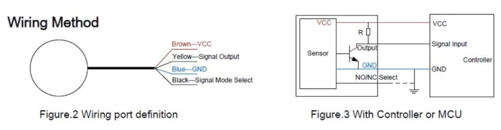

# FillerUp Buddy
[Back to Top](../README.md)

# Current Status
Prototype V2
# Hardware
- An ESP32 or ESP286 running Tasmota. 
- Two [Contactless Water Level Sensors](https://amzn.to/3FcRsNK)
- A DIY Humidifier
- An Enclosure
# DIY Humidifier
TODO
# Water Level Sensors
[DFRobot's Schematic](https://github.com/solarslurpi/GrowBuddy/blob/main/docs/SEN0204%20%20Liquid%20Level%20Sensor-XKC-Y25-T12V.pdf)
The [Contactless Water Level Sensors](https://amzn.to/3FcRsNK)
The image shows how to wire each sensor:

## Wiring 

## Wire Colors
- The BLUE and BLACK wires can be combined and then go to ground.
- The BROWN wire goes to 3.3V.
- The YELLOW wire goes to a GPIO pin.  There is a 1K pull-up resistor between 3.3V and the GPIO wire.

One sensor is used to detect when there is not enough water.  If this sensor is triggered, a water pump is turned on an water flows into the humidifier's container.  The other sensor is used to detect when the container is full.  If this sensor is triggered, the water pump is turned off.

_TBD: Can all this be done without node-red?_

set up switch 1 for low water level.  FULL  - When switch = OFF, there is water.  EMPTY - When switch = ON.  No water detected.  Also sensor red light is on when full/switch is off.