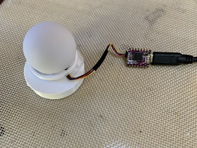
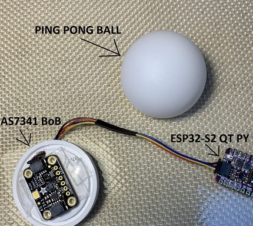
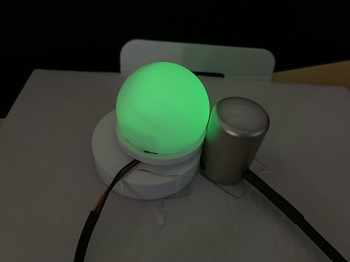

# Feedback
All constructive feedback is very much welcome.  I do not have any formal training but do love learning.  Please send feedback to happyday.github@gmail.com.  Thank you.
# What is PAR Buddy
PAR Buddy is a DIY PPFD sensor with "dreams" of being "good enough" for home growers to use as a guide for adjusting the height of indoor LEDs during a grow season.



It is built using off-the-shelf electronics, a ping pong ball, and a 3D printed enclosure.  



Just by noting the ping pong ball, it should be quite clear that getting as accurate as the MQ-500 is not going to happen.  But I am curious given my limited background in all this stuff, __can PAR Buddy act as a "good enough" substitute for a PPFD measuring device for indoor hobby growers?...let's EXPLORE!__
# Sacrificial Draft Prototype
The current version of the prototype is 0.00001A - the first...sacrificial draft.
# Results from this Prototype
I find it frustrating when I am starting to read an article that I don't have an idea of the outcome.  Here are the results:
## Multiple Linear Regression
As highlighted in  [A Novel Approach to Obtain PAR with a Multi-Channel Spectral Microsensor, Suitable for Sensor Node Integration](https://www.researchgate.net/publication/351584740_A_Novel_Approach_to_Obtain_PAR_with_a_Multi-Channel_Spectral_Microsensor_Suitable_for_Sensor_Node_Integration), a strong contender for determining the relationship between PAR Buddy readings and an Apogee mq-500 is Multiple Linear Regression (MLR).  This is the approach taken in the [PAR Buddy mlr jupyter notebook](https://github.com/solarslurpi/GrowBuddy/blob/main/notebooks/PAR_Buddy_mlr.ipynb).  The conclusions section noted:
|dataframe|# Samples|RMSE|r2|
|---------|------|------|----|
|readings|173|92.8|0.94|
|readings_white|74|16.9|0.996|
|readings_burple|43|46.7|0.95|
|readings_burple_red|56|85.3|0.81|

My (possibly naive) observation/thoughts:
- For all dataframes, the r2 value shows there is a strong enough linear dependency between the PAR_Buddy readings and the PPFD value of the mq-500 PAR meter.
- The number of samples was inconsistent across the dataframes.  This is where "I don't know" comes in how significant this is.  My thought is there are enough samples for each LED system to be statistically significant.
- burple_red shows the worst fitting of the LED system.  I suspect the lack of sampling in the 700nm range contributed to an r2 of < 90%.
- While the readings dataframe showed a high r2 of 94%, I feel most comfortable calibrating each LED system with only data taken from that LED system.
## Machine Learning
__TBD__

## Hardware and Firmware
### AS7341 Multi-Channel Spectrometer
The protagonist in this story is [Adafruit's AS7341 breakout board (BoB)](https://www.adafruit.com/product/4698).  This 11 channel spectrum sensor detects 8 channels within the visible light spectrum.:
1. 415nm
2. 445nm
3. 480nm
4. 515nm
5. 555nm
6. 590nm
7. 630nm
8. 680nm


and [Adafruit's Circuit Python AS7341 library](https://github.com/adafruit/Adafruit_CircuitPython_AS7341/blob/main/adafruit_as7341.py).

I combined this powerful BoB with:
- [Adafruit's QT Py ESP32-S2](https://www.adafruit.com/product/5325)
- a 3D printed holder for the ping pong ball and the AS7341 BoB
- CircuitPython code loaded onto the QT PY:
    - [code.py](../CP_code/code.py)
    - [PAR_LIB.py](../CP_code/PAR_LIB.py)
- Raspberry Pi 3+ running the mosquitto mqtt broker.  More details on how mqtt is used in the [Taking Samples section](#taking_samples).
- A Ping Pong ball that acts as a diffuser. _Note: My optics on optics is very poor.  I opted for a Ping Pong ball after much gnashing of teeth as I read how other makers approached the implementation of a diffuser.

#### Changes to Default Settings
Default sampling settings in Adafruit's AS7341 library set:
```
def initialize(self):
    """Configure the sensors with the default settings"""

    self._power_enabled = True
    self._led_control_enabled = True
    self.atime = 100
    self.astep = 999
    self.gain = Gain.GAIN_128X  # pylint:disable=no-member
```
cause readings in these high light scenarios to be unusable/oversaturated (i.e: readings with values of 65535).

[The article that explores the AS7431 as a PAR meter](https://www.ncbi.nlm.nih.gov/pmc/articles/PMC8152513/) used the following settings:
_The ADC was configured with an integration time of 100 ms with a gain of four for all eight channels in the visible spectrum and a gain of one for the remaining IR channels. The settings are chosen in a way that the channel outputs are about half of the maximum possible count number on a cloud-less bright summer day._

According to the [AS7341 datasheet](https://ams.com/en/as7341), the interval time is calculated:
$$ t_{𝑖𝑛𝑡} = (𝐴𝑇𝐼𝑀𝐸 + 1) × (𝐴𝑆𝑇𝐸𝑃 + 1) × 2.78µ𝑠 $$
Given the AS7341 library's default,
```
interval time = (100 + 1) * (999 + 1 ) * 0.00278ms
= 101 * 2.78ms
= 280.78ms
```
The current settings have a sampling time of 280.78 ms.  The article set the sampling time to 100ms, but doesn't tell us values for astep or atime.  I am a builder, not an expert, so given my current knowledge:
- astep points to the resolution of readings when converting an analog to digital value (i.e.: the number of voltage steps).  The larger the astep, the higher the resolution.  
- atime points to the actual time it takes to mungle about with the sample.

I have two unknowns.  I'll set the astep to 599.  The interval time is 100ms so we have:
```
100 = (ATIME + 1) * 600 * 0.00278
100/(600 * 0.00278) = 60
ATIME = 59

100 = 60 * 600 * 0.0028 = 108
```
The settings set in PAR_LIB.py:
```
self.sensor.gain = Gain.GAIN_4X
self.atime = 59
self.astep = 599
```
#### Green Glow
The AS7341 BoB has a green LED that lights up when it receives power.  The good news is it creates this eerie green orb which looks pretty awesome.



The bad news is the light has the potential to affect the readings.  Because of this, I put a piece of electrician's tape over the LED to mask the light.  I guess I could have just desoldered the LED but I feel covering the green glow works well.

# Taking Samples<a name="taking_samples"></a>


1. PAR Buddy and the mq-500 are placed side by side at different positions in the x,y,z planes.  Two grow lights are used for testing:
    - [MAXSISUN PB1000 Pro Grow Light](https://amzn.to/3uKqPy5) (the "white" LEDs)
    - [Advanced Platinum Series P300 300w](https://amzn.to/3sBnTRR) (the "burple" LEDs.  There are two settings, one for flower one for bloom.  I differentiate readings by using either the burple or burple_red prefix when naming sample files).
2. A reading flow is started by sending an mqtt message, `topic=PAR\READING_TAKE`, `message = PPFD` reading from the mq-500 using the [EasyMQTT app](https://www.easymqtt.app/) from an iPhone.  In the example, the PPFD reading on the mq-500 was 250 μmol/m2/s.
3. The Circuit Python code running on the PAR Buddy ([code.py](../CP_code/code.py) and [PAR_LIB.py](../CP_code/PAR_LIB.py))  "hears" the topic and responds by:
- Taking readings of the AS7341's 8 channels that are in the visible light (i.e.: correspond to the PAR spectrum).
- Putting the readings in a Python list datatype.
- Inserting the PPFD reading that came as the message a the first element in the list.
- Sending the list of 9 elements (PPFD reading from mq-500 and 8 channels from AS7341) as an mqtt message, `topic=PAR/READING_SAVE`,`message=<readings list as a JSON string>.
4. When the Raspberry Pi sees there is a message with the topic `PAR/READING_SAVE` available, it takes the message payload, transforms it into a CSV string, and then writes it to a readings.csv file.  
5. The Rasp Pi then sends a message with the topic `PAR/READING_OK` with the message payload set to the values in the CSV string. The readings can then be verified as read by subscribing to the `PAR/READING_OK` message.


## Store Readings.csv on GitHub
Before taking another round of readings, the `readings.csv` file is copied from the Raspberry Pi into [a directory of readings](https://github.com/solarslurpi/GrowBuddy/tree/main/data).  The filenamnes are named `white`, `burple` or `burple_red` plus `<the date recorded>`.csv.  All contents of the `readings.csv` file are deleted.

For example, `white_02092020.csv` means the readings in this file were taken under the "white" LEDs on February 9th, 2022.
# Calibration Model
The "BIG JOB" we have is to figure out the (numerical) relationships between the readings from the AS7341 and the PPFD value of the mq-500.  __Is there a strong enough relationship between the light spectrum channel readings from the AS7341 and the mq-500?__  To find out we'll look at it from two ways:
- multiple linear regression
- machine learning

Both will be evaluated using Jupyter notebooks.
## Multiple Linear Regression  
The steps taken to model using MLR is contained in [a colab notebook, PAR_Buddy_mlr.ipynb](https://github.com/solarslurpi/GrowBuddy/blob/main/notebooks/PAR_Buddy_mlr.ipynb)

The MLR approach solves for the y-intercept and the 8 coefficients:
$$ PPFD = b_0 + \sum_{i=1}^{n=8} (b_ix_i) + \epsilon $$

This is the approach taken in  [A Novel Approach to Obtain PAR with a Multi-Channel Spectral Microsensor, Suitable for Sensor Node Integration](https://www.researchgate.net/publication/351584740_A_Novel_Approach_to_Obtain_PAR_with_a_Multi-Channel_Spectral_Microsensor_Suitable_for_Sensor_Node_Integration).

Please see the [colab notebook](https://github.com/solarslurpi/GrowBuddy/blob/main/notebooks/PAR_Buddy_mlr.ipynb) for details and results.

## Machine Learning


oohhh...how weighty!


