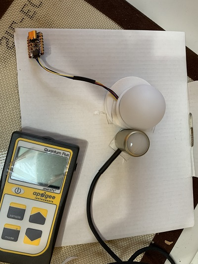

# What is PAR Buddy
PAR Buddy is a DIY PPFD sensor with "dreams" of being "good enough" for home growers to use as a guide for adjusting the height of indoor LEDs during a grow season.


It is built using off-the-shelf electronics, a ping pong ball, and a 3D printed enclosure.  


Just by noting the ping pong ball, it should be quite clear that getting as accurate as the MQ-500 is not going to happen.  But I am curious given my limited background in all this stuff, __can PAR Buddy act as a "good enough" substitute for a PPFD measuring device for indoor hobby growers?...let's EXPLORE!__
# Sacrificial Draft Prototype
The current version of the prototype is 0.00001A - the first...sacrificial draft.
## Hardware
- A Ping Pong ball that acts as a diffuser. _Note: My optics on optics is very poor.  I don't know what words to Google...thus I opted for a Ping Pong ball after much gnashing of teeth as I read how other makers approached the implementation of a diffuser.
- [Adafruit's AS7341 Breakout Board (BoB)](https://www.adafruit.com/product/4698)
- [Adafruit's QT Py ESP32-S2 ](https://www.adafruit.com/product/5325)
- [A Stemma QT cable](https://www.adafruit.com/product/4399) connecting the AS7341 to the QT PY.
- A Raspberry Pi 3+
## Software
# Taking Samples


1. PAR Buddy and the mq-500 are placed side by side at different positions in the x,y,z planes.  Two grow lights are used for testing:
    - [MAXSISUN PB1000 Pro Grow Light](https://amzn.to/3uKqPy5) (the "white" LEDs)
    - [Advanced Platinum Series P300 300w](https://amzn.to/3sBnTRR) (the "burple" LEDs)
2. A reading flow is started by sending an mqtt message, `topic=PAR\READING_TAKE`, `message = PPFD` reading from the mq-500 using the [EasyMQTT app](https://www.easymqtt.app/) from an iPhone.  In the example, the PPFD reading on the mq-500 was 250 μmol/m2/s.
3. The Circuit Python code running on the PAR Buddy ([code.py](../CP_code/code.py) and [PAR_LIB.py](../CP_code/PAR_LIB.py))  "hears" the topic and responds by:
- Taking readings of the AS7341's 8 channels that are in the visible light (i.e.: correspond to the PAR spectrum).
- Putting the readings in a Python list datatype.
- Inserting the PPFD reading that came as the message a the first element in the list.
- Sending the list of 9 elements (PPFD reading from mq-500 and 8 channels from AS7341) as an mqtt message, `topic=PAR/READING_SAVE`,`message=<readings list as a JSON string>.
4. When the Raspberry Pi sees there is a message with the topic `PAR/READING_SAVE` available, it takes the message payload, transforms it into a CSV string, and then writes it to a readings.csv file.  
5. The Rasp Pi then sends a message with the topic `PAR/READING_OK` with the message payload set to the values in the CSV string. The readings can then be verified as read by subscribing to the `PAR/READING_OK` message.

## Store Readings.csv on GitHub
Before taking another round of readings, the `readings.csv` file is copied from the Raspberry Pi into [a directory of readings](https://github.com/solarslurpi/GrowBuddy/tree/main/data).  The filenamnes are named `white` or `burple` plus `<the date recorded>`.csv.  All contents of the `readings.csv` file are deleted.

For example, `white_02092020.csv` means the readings in this file were taken under the "white" LEDs on February 9th, 2022.
# Calibration Model
The "BIG JOB" we have is to figure out the (numerical) relationships between the readings from the AS7341 and the PPFD value of the mq-500.  Is this relationship strong enough that we can understand what we need to "plug in" when we take a reading with the AS7341 to get to a PPFD value that is not good enough for the professional grower, but good enough for a home grower who needs it mostly to adjust the distance the LEDs are from the plant's leaves.

Similar to how the approach used to calculate the PPFD using an AS7341 sensor in [A Novel Approach to Obtain PAR with a Multi-Channel Spectral Microsensor, Suitable for Sensor Node Integration](https://www.researchgate.net/publication/351584740_A_Novel_Approach_to_Obtain_PAR_with_a_Multi-Channel_Spectral_Microsensor_Suitable_for_Sensor_Node_Integration), we'll use a multiple linear regression model.  

Based on what I know, we can then build a model based on a Multiple Linear Regression approach:
$$ PPFD = b_0 + \sum_{i=1}^{n=8} (b_ix_i) + \epsilon $$

Or using machine learning


oohhh...how weighty!


# System

# Hardware

# Calibration
To calibrate, the approach taken in the article, [_A Novel Approach to Obtain PAR with a Multi-Channel Spectral Microsensor_](https://pubmed.ncbi.nlm.nih.gov/34068029/) will be used.

A statistically significant number of samples will be fed into a multiple linear regression to find the slope intercept and coefficients.

$$ PPFD = b_0 + \sum_{i=1}^{n=8} (b_ix_i) + \epsilon $$

A sample consists of:
- reading the PPFD of a known reference - in this case an Apogee meter.
- readings from the 8 channels on the as7341 that are within the PAR range.


# Calibrator Prototype
To capture the channel values, I built a prototype consisting of:
- [Adafruit's AS7341 breakout board (BoB)](https://www.adafruit.com/product/4698)
- [Adafruit's QT Py ESP32-S2](https://www.adafruit.com/product/5325)
- a Ping Pong ball that acts as a diffuser.
- a 3D printed holder for the ping pong ball and the AS7341 BoB
- CircuitPython code loaded onto the QT PY:
    - [code.py](../CP_code/code.py)
    - [PAR_LIB.py](../CP_code/PAR_LIB.py)
- mqtt broker running on a Raspberry Pi.  The CP code in code.py publishes the channel readings to the mqtt broker which is picked up by a nodered flow.  The nodered flow stores the reading as a CSV line within a file on the Raspberry Pi.


## First Test
I used an LED light setup as my first test.


I did not change any settings on the AS7341 as set by [Adafruit's Circuitpython library](https://github.com/adafruit/Adafruit_CircuitPython_AS7341)
From looking at the defaults set in the [AS7341 CP library code](https://github.com/adafruit/Adafruit_CircuitPython_AS7341/blob/main/adafruit_as7341.py):
```
def initialize(self):
    """Configure the sensors with the default settings"""

    self._power_enabled = True
    self._led_control_enabled = True
    self.atime = 100
    self.astep = 999
    self.gain = Gain.GAIN_128X  # pylint:disable=no-member
```
### Observation
The LED on the AS7341 BoB maintained its eerie green LED glow which I would think would alter the channel readings by including this light source.


### Results
```
2304,10226,10187,16548,24773,32891,35828,18372
16835,65535,65535,65535,65535,65535,65535,65535
15328,65535,60568,65535,65535,65535,65535,65535
13944,61563,55751,65535,65535,65535,65535,65535
12124,53645,49194,65535,65535,65535,65535,65535
9827,43549,40641,65535,65535,65535,65535,65535
```
Many of the samples maxed out the value.  So there are two things I'll fix for the next test:
- Turn the green LED off.
- Change the interval time so the readings aren't maxed out due to oversaturation.

#### Turn off the Green LED
There are two LEDs on the BoB:
- a bright white which is be default off.  This can be turned on through the led property where sensor.led = True turns the LED on to a bright light.
- a green LED that is "hard wired" to the power circuit.  There is nothing I can find in the AS7341 library to turn this off.

The easiest way I thought of to turn the green LED off is to cover it with dark tape.
#### Getting readings that don't oversaturate
The ADC's Gain and Interval Time affect the values.
##### Gain and Interval Time
[The article that explores the AS7431 as a PAR meter](https://www.ncbi.nlm.nih.gov/pmc/articles/PMC8152513/) used the following settings:
_The ADC was configured with an integration time of 100 ms with a gain of four for all eight channels in the visible spectrum and a gain of one for the remaining IR channels. The settings are chosen in a way that the channel outputs are about half of the maximum possible count number on a cloud-less bright summer day._

According to the [AS7341 datasheet](https://ams.com/en/as7341), the interval time is calculated:
$$ t_{𝑖𝑛𝑡} = (𝐴𝑇𝐼𝑀𝐸 + 1) × (𝐴𝑆𝑇𝐸𝑃 + 1) × 2.78µ𝑠
$$
Given the AS7341 library's default,
interval time = (100 + 1) * (999 + 1 ) * 0.00278ms
= 101 * 2.78ms
= 280.78ms

###### Interval Time
OK.  So the current settings have a sampling time of 280.78 ms.  The article set the sampling time to 100ms, but doesn't tell us values for astep or atime.  I am a builder, not an expert, so given my current knowledge:
- astep points to the resolution of readings when converting an analog to digital value (i.e.: the number of voltage steps).  The larger the astep, the higher the resolution.  
- atime points to the actual time it takes to mungle about with the sample.

I have two unknowns.  I'll set the astep to 599.  The interval time is 100ms so we have:
```
100 = (ATIME + 1) * 600 * 0.00278
100/(600 * 0.00278) = 60
ATIME = 59

100 = 60 * 600 * 0.0028 = 108
```
sensor.atime = 59 sensor.astep = 599
###### Gain
The default gain is 128x.  The article set the gain for the visible channels to a gain of 4x.
sensor.gain = sensor.gain.GAIN_4X
### New Results
New results are within ranges that can be sampled:
```
3152,17180,6920,18764,28643,26845,21375,11130
4070,21699,8381,24061,37087,34443,26972,13683
8259,38644,13648,46921,52489,48042,36851,16561
```
