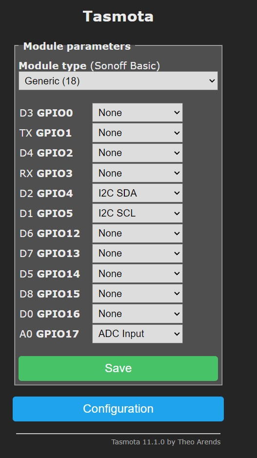
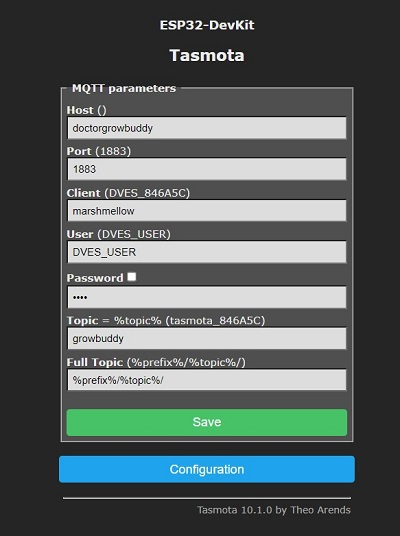

# Sniffer Buddy 
[Back to Top](../README.md)


1) Reads the light level, air temperature, CO2 level, and humidity.
2) Uses mqtt to publish the readings to the mqtt broker running on the growdaddy rasp pi server using the `tele/growbuddy/SENSOR` topic.


# Current Status
Prototype V2 running on an [ESP286 D1 mini](https://i2.wp.com/randomnerdtutorials.com/wp-content/uploads/2019/05/ESP8266-WeMos-D1-Mini-pinout-gpio-pin.png?quality=100&strip=all&ssl=1).
## Learnings from V1
- We were not using Tasmota/wifi for each Buddy.  Instead, we wired directly to a Raspberry Pi.  This proved to be an unreliable bunch-o-wires bundle.  With Tasmota/wifi, we don't need to put the Raspberry Pi inside the Grow Tent.  Removed A LOT of clutter.
- Tasmota afforded an easy way to get from putting the sensor together with an ESP chip and getting to mqtt messages.
- mqtt is a great technology for all these buddies interacting to help us with mundane tasks.
- getting to a good enclosure is really hard. More planning is needed.  Particularly around wires and connectors.  I'll collect my thoughts on wiring on [the wiring page](WIRING_and_connectors.md)
- getting to a good physical device requires special attention to wiring.  Which becomes a mess.  More attention to detail is needed in wiring and what connectors to use.
- The current ESPs do not handle battery powered.  The Buddies need to be plugged into power.
# Hardware
I am using a very inexpensive mini D1 ESP286 I got awhile back. 
## Tasmota configuration on mini D1 ESP286
When I first install the `Tasmota Sensors` build on an ESP286, The console has been configured to be `Sonoff basic` module type.  I change this to `Generic(18)` module type.




 I am concerned about the stability...but for now it seems good enough for the prototype.

## mqtt
mqtt is a great technology for sending messages such as sensor readings to other devices that want to receive the messages (i.e.: subscribe to the messages)

### mqtt Configuration



### Example Message

Here is an example of the mqtt message with the `tele/growbuddy/sensor` that gets published:
```
"ANALOG":{"A0":1023},"SCD30":{"CarbonDioxide":598,"eCO2":569,"Temperature":24.7,"Humidity":46.4,"DewPoint":12.4}
```
The message is picked up by anyone subscribed to this topic - like the node-red flows.
Here's what the message looks like in a node-red flow:
```
{"Time":"2022-01-11T08:58:34","ANALOG":{"A0":1016},"SCD30":{"CarbonDioxide":648,"eCO2":648,"Temperature":26.2,"Humidity":45.1,"DewPoint":13.3},"TempUnit":"C"}
```
To parse this, we use a function in node-red:
```
const result = JSON.parse(msg.payload);
const CO2_level = result.SCD30.CarbonDioxide;
const Humidity_level = result.SCD30.Humidity;
const Temperature = result.SCD30.Temperature*9/5 + 32
node.warn('****'+CO2_level+'   '+Humidity_level + '  ' + Temperature);
node.warn('*** light level: ' + result.ANALOG.A0);
return msg;
```


### Enclosure
The enclosure was designed within F360 and printed on a Prusa MK3s.  Files within the enclosure folder include:
- [GrowBuddyParams.csv](https://github.com/solarslurpi/GrowBuddy/blob/main/enclosure/GrowBuddyParams.csv): settings imported into F360.
- [Fusion 360 and 3mf files](https://github.com/solarslurpi/GrowBuddy/tree/main/enclosure)
### Hardware in This Prototype
- [SCD30 sensor from Adafruit](https://www.adafruit.com/product/4867)
- [ESP826 D1 mini](https://i2.wp.com/randomnerdtutorials.com/wp-content/uploads/2019/05/ESP8266-WeMos-D1-Mini-pinout-gpio-pin.png?quality=100&strip=all&ssl=1) I had in my parts bin.
- Photoresistor and 10K resistor for light on/off detection.  I also had these parts in my parts bin.

#### Requires Plug to Run

_Note: I wanted to use a battery to power the Air Sensor.  However, it turns out the ESP286/ESP32 was not designed for battery power. From a Discord chat:_
```
ESP8266 is not suitable for battery operation, unless long deep sleep intervals

Due to the extra battery t[d]rain, probably not too much shorter than 5 minutes
```
With that said, perhaps running on a plug is not a big deal because there will be a need for many devices to be powered within a grow tent.

### Firmware
The Sniffer Buddy uses the Tasmota Sensors build.  This is my first use of Tasmota.  Because I project several of the Buddies will be using Tasmota, I've collected what I have learned [in a separate page focused on Tasmota Learning](../pages/Tasmota_learnings.md)