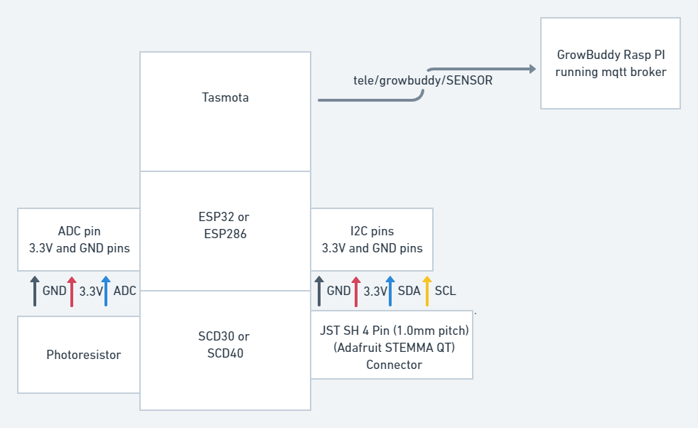

# Sniffer Buddy 
[Back to Top](../README.md)


1) Reads the light level, air temperature, CO2 level, and humidity.
2) Uses mqtt to publish the readings to the mqtt broker running on the growdaddy rasp pi server using the `tele/growbuddy/SENSOR` topic.



Here is an example of the mqtt message with the `tele/growbuddy/sensor` that gets published:
```
"ANALOG":{"A0":1023},"SCD30":{"CarbonDioxide":598,"eCO2":569,"Temperature":24.7,"Humidity":46.4,"DewPoint":12.4}
```
The message is picked up by anyone subscribed to this topic - like the node-red flows.

## Current Status
Prototype V2


### Hardware in This Prototype
- [SCD30 sensor from Adafruit](https://www.adafruit.com/product/4867)
- [ESP826 D1 mini](https://i2.wp.com/randomnerdtutorials.com/wp-content/uploads/2019/05/ESP8266-WeMos-D1-Mini-pinout-gpio-pin.png?quality=100&strip=all&ssl=1) I had in my parts bin.
- Photoresistor and 10K resistor for light on/off detection.  I also had these parts in my parts bin.

#### Requires Plug to Run

_Note: I wanted to use a battery to power the Air Sensor.  However, it turns out the ESP286/ESP32 was not designed for battery power. From a Discord chat:_
```
ESP8266 is not suitable for battery operation, unless long deep sleep intervals

Due to the extra battery t[d]rain, probably not too much shorter than 5 minutes
```
With that said, perhaps running on a plug is not a big deal because there will be a need for many devices to be powered within a grow tent.

### Firmware
The Sniffer Buddy uses the Tasmota Sensors build.  This is my first use of Tasmota.  Because I project several of the Buddies will be using Tasmota, I've collected what I have learned [in a separate page focused on Tasmota Learning](../pages/Tasmota_learnings.md)