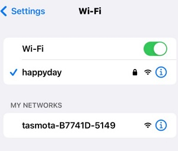
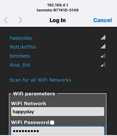
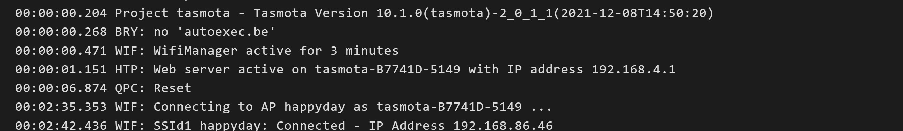

# Tasmota Learnings
[Back to Top](../README.md)
# Challenges
We put this section at the top because we didn't want to bury "the hacks" we needed to get stuff working right.
## SnifferBuddy SCD30 Takes a Restart to Work
We found out that when the SnifferBuddy boots, the SCD30 readings are not there.  Restarting fixed this problem.  We added the following rule:
```
Rule1 on System#Boot DO restart 1 endon
on System#Wake Do
    restart 1
endon
```

# ESPs we have used
Tasmota runs on an ESP.  Either an ESP32 or ESP286.  Here are the two I've tried:
- [Wemos mini32](https://forum.mhetlive.com/topic/8/mh-et-live-minikit-for-esp32)...This is a cheap clone that isn't really a Wemos..
- [ESP286 D1 mini](https://i2.wp.com/randomnerdtutorials.com/wp-content/uploads/2019/05/ESP8266-WeMos-D1-Mini-pinout-gpio-pin.png?quality=100&strip=all&ssl=1)...another cheap clone I got from aliexpress.
## Installation
The easiest way to install Tasmota is using either the Edge or Chrome browser (web install doesn't work using the Brave browser) and go to [Tasmota Install URL](https://tasmota.github.io/install/).

_Note:  If the USB/COM port can't be identified, the first thing to do is to change cables.  The USB cable might not support data i/o.  If that doesn't work, check the USB driver.  The ESP286 or ESP32 may be using a driver that isn't installed on your Windows PC or Mac._

There are many Tasmota binaries that could be installed.  We want to install the Tasmota Sensors binary.

After installation, the wifi needs to be set up.
1. Go into your phone's wifi setup and choose the Tasmota wifi Access Point.



2. After a bit, a login screen will appear that will take you to a Tasmota screen where you enter your wifi's SSID and password.



If all goes well, you can look at the logs and see something like:



Here we've been given a local IP address of 192.168.86.46 on the wifi with the SSID of happyday.
## Setup
### Teleperiod
Go to the Console and:
- Set up the period between sending the sensor readings over mqtt:
We do this through the The `teleperiod` command.  e.g.:
```
teleperiod 20
```
sets sending readings via mqtt to occur every 20 seconds.
### Local Time
Also in the Console, I just did the most simple way and set the timezone to North America Pacific (which is 8 hours behind)  with the command `timezone -8` (see [Tasmota commands](https://tasmota.github.io/docs/Commands/#management)

This command set the correct timezone stuff for PST:

Use the web console to configure the Timezone (this shows Pacific time):
```
Backlog Timezone 99 ; TimeDST 0,2,03,1,3,-420 ; TimeSTD 0,1,11,1,2,-480
```
The 99 says to use TimeDST and TimeSTD. Use "time" to check.

[Thank you Craig's Tasmota page](https://xse.com/leres/tasmota/)
### i2cscan
Executing `i2cscan` from the console is useful to show you if the i2c sensor is wired correct.y

### Switchmode
We use the [Tasmota command `switchmode`](https://tasmota.github.io/docs/Buttons-and-Switches/#switchmode) to tell Tasmota to send an mqtt message when there is a change in state for a water level sensor:
```
switchmode1 15
switchmode2 15
```

##  What I've Learned
- Super easy to use a sensor with a driver pre-built into the Tasmota Sensors build.  

- Best when using mqtt to pass messages such as sensor readings to an automation system.  See some [mqtt examples](https://tasmota.github.io/docs/MQTT/#examples)
## Checking Installed Drivers
The first thing to make sure, is what version of the Tasmota binary is installed.  Most of the time, we will want the sensor build.

The drivers we have used have been for i2cdevices.
When running `i2cdevice` on the command line, [the numbers associated with the drivers](https://tasmota.github.io/docs/I2CDEVICES/#supported-i2c-devices) are returned. Note number 29 is the number for the SCD30 driver.
```
09:02:00.512 CMD: Grp 0, Cmd 'I2CDRIVER', Idx 1, Len 0, Pld -99, Data ''
09:02:00.520 MQT: stat/snifferbuddy/RESULT = {"I2CDriver":"7,8,9,10,11,12,13,14,15,17,18,20,24,29,31,36,41,42,44,46,48"}
```
## Rules
[Rules](https://tasmota.github.io/docs/Rules/) are a powerful feature of Tasmota.  I ended up not using a rule for __the Sniffer Buddy__, however as I was exploring Rules, I ended up writing this one that worked.  I include it here to enhance our knowledge of how to write rules:
#### Rule to Publish Light ON/OFF Events
Useful resources:
- [Howto:...rules... ](https://community.homey.app/t/howto-extend-the-use-of-a-wemos-d1-mini-using-rules-mqtt-client/13016)
- [Tasmota Rules Doc](https://tasmota.github.io/docs/Rules/#toggle-relay-when-holding-button-for-2-seconds)
```
Rule1
Rule 5
Rule on analog#a1>4000= do publish tele/growbuddy/SENSOR ON endon on analog#a1<4000 do publish tele/growbuddy/SENSOR OFF endon
Rule1 1
```
- `Rule1` identifies this rule to be within the `Rule1` set.
- `Rule 5` stops sending repetitive message.  The rule is only triggered on a change.
- The rule is then _if the reading on the Analog A1 pin is greater than 4000 (for the first time in awhile) publish an "ON" over mqtt.. likewise, the first time the reading changes from being above 4000 to below 4000, send an "OFF" message.  The reasong it is 4000 has to do with this being an ESP32 and the ADC has a resolution of 0 to 4095.__
The first line enables the rules, the second stops repetitive messages & only triggers on a change & the third line sends a message based on the value of the LDR crossing a threshold. Please note that the 200 above will need to be modified to suit your setup.
- `Rule1 1` Enables the rule.
