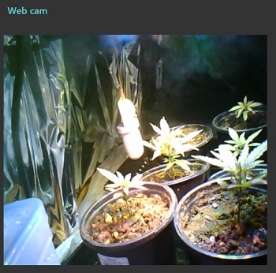

# Cam Buddy
Cam Buddy provides a web cam and timelapse using a low cost ESP32-CAM.

# Hardware
- [ESP32 CAM by AI Thinker](https://amzn.to/3LHZ6UN)
- USB cable
- 3d Printed enclosure
# Software
From my limited experience, folks using the ESP32-CAM have been enabled by the Arduino IDE libraries and example code.  The one I ended up starting with is the [ESPAsyncWebServer library](https://github.com/me-no-dev/ESPAsyncWebServer).  I started with straight ESP32-CAM Video Streaming as [well documented in a Random Nerd Tutorial](https://randomnerdtutorials.com/esp32-cam-video-streaming-web-server-camera-home-assistant/).  Unfortunately, the synchronous nature did not allow me to also send timelapse images to a Raspberry Pi for the timelapse gif.

## Features
- Live Stream
- TimeLapse photos taken once an hour when the LED lights are on.
It is up to you to place cam buddy so the camera has the best view it can of the plants.

Installed [FTP Server on Rasp Pi](https://phoenixnap.com/kb/raspberry-pi-ftp-server)