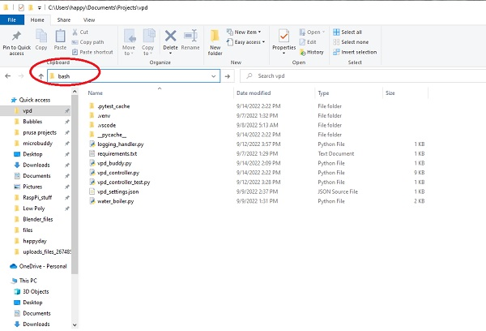

# Raspberry Pi Learnings
[Back to Top](../README.md)
# Why This Page
As I do projects, I'll use commands here and there unique to a platform - in this case Raspberry Pi/Linux - that I don't use very much.  I'm listing commands and flows I found useful when bumbling about on the Raspberry Pi.
# Stuff I Learned Awhile Back
I used to blog my projects on my GitHub bitknitting account.  I have many projects there.  I screwed up my access so I ended up with a new account/GitHub repo (heavy sigh at my silliness). 
# Systemd Services
## Listing Services
[My earlier write up about working with Systemd services.](https://github.com/BitKnitting/should_I_water/wiki/systemd-services)

If I want something always running on the Raspberry Pi, I start up a SystemD service.  Over time, I forget what I've done.  This command lists the systemd services.
```
pi@growbuddy:~ $ systemctl --type=service

UNIT                                                        LOAD   ACTIVE SUB     DESCRIPTION
alsa-restore.service                                        loaded active exited  Save/Restore Sound Card State
alsa-state.service                                          loaded active running Manage Sound Card State (restore and
avahi-daemon.service                                        loaded active running Avahi mDNS/DNS-SD Stack
bluetooth.service                                           loaded active running Bluetooth service
bthelper@hci0.service                                       loaded active exited  Raspberry Pi bluetooth helper
camBuddy.service                                            loaded active running camBuddy mqtt Script Service
console-setup.service                                       loaded active exited  Set console font and keymap
cron.service                                                loaded active running Regular background program processing
dbus.service                                                loaded active running D-Bus System Message Bus
dhcpcd.service                                              loaded active running dhcpcd on all interfaces
dphys-swapfile.service                                      loaded active exited  dphys-swapfile - set up, mount/unmoun
fake-hwclock.service                                        loaded active exited  Restore / save the current clock
getty@tty1.service                                          loaded active running Getty on tty1
```
## Stop A service
```
pi@growbuddy:~ $ sudo systemctl stop PAR_BUDDY_HANDLER.service
```
## Disable service from restarting on Boot
```
pi@growbuddy:~ $ sudo systemctl disable PAR_BUDDY_HANDLER.service
Removed /etc/systemd/system/multi-user.target.wants/PAR_BUDDY_HANDLER.service.
```
# Copy File from Rasp Pi to Windows
Currently I am on a Windows PC:
- open Explorer, go to the directory to use rsync, type in bash in the text field for the filepath.



A wsl window will open at this location.
```
sudo rsync -avh pi@growbuddy:/home/pi/growbuddy_1_data.zip  .

```